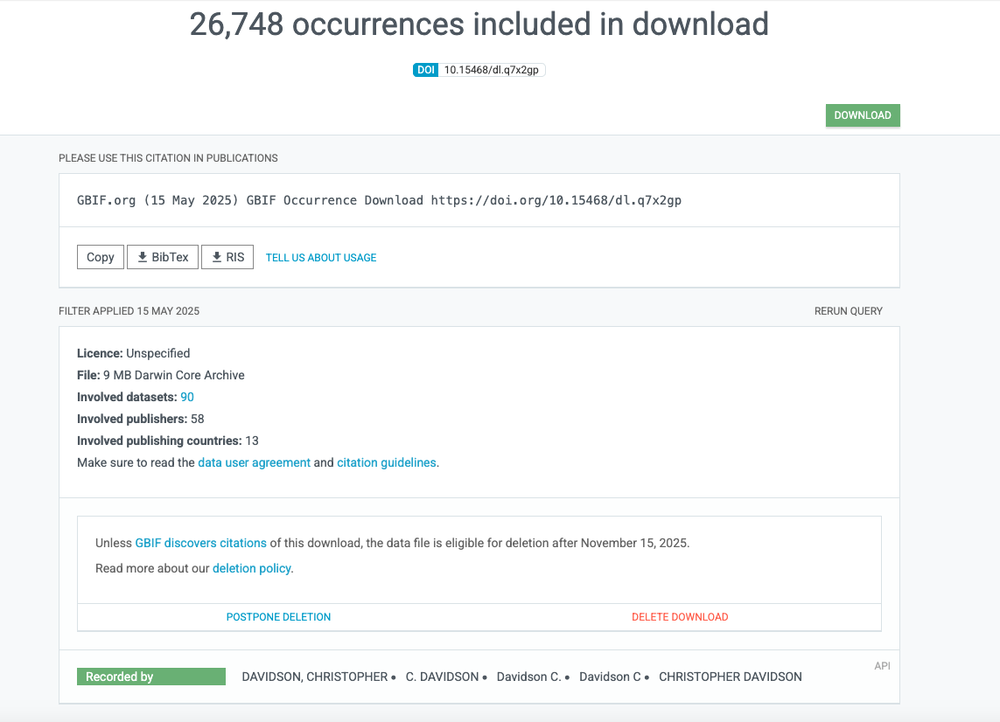

```{r packages, echo=FALSE, warning=FALSE, include=FALSE, cache = FALSE}
###~~~
# Load R packages
###~~~
#Create vector w/ R packages
# --> If you have a new dependency, don't forget to add it in this vector
pkg <- c("knitr", "rmarkdown", "bookdown", "formattable", "kableExtra", "dplyr", "magrittr", "prettydoc", "htmltools", "knitcitations", "bibtex", "devtools", "kfigr", "data.tree", "DT", "DiagrammeR", "rticles")

##~~~
#2. Check if pkg are installed
##~~~
print("Check if packages are installed")
#This line outputs a list of packages that are not installed
new.pkg <- pkg[!(pkg %in% installed.packages())]

##~~~
#3. Install missing packages
##~~~
# Using an if/else statement to check whether packages have to be installed
# WARNING: If your target R package is not deposited on CRAN then need to adjust code/function
if(length(new.pkg) > 0){
  print(paste("Install missing package(s):", new.pkg, sep=' '))
  install.packages(new.pkg, dependencies = TRUE)
}else{
  print("All packages are already installed!")
}

##~~~
#4. Load all packages
##~~~
print("Load packages and return status")
#Here we use the sapply() function to require all the packages
# To know more about the function type ?sapply() in R console
sapply(pkg, require, character.only = TRUE)

#Generate BibTex citation file for all R packages used to produce report
knitr::write_bib(.packages(), file = 'packages.bib')
```

```{r setup, include = FALSE, cache = FALSE, message = FALSE}
# Chunk options: see http://yihui.name/knitr/options/ ###

## Text results
#opts_chunk$set(echo = TRUE, warning = TRUE, message = TRUE, include = TRUE)

## Code decoration
opts_chunk$set(tidy = TRUE, tidy.opts = list(blank = FALSE, width.cutoff = 60), highlight = TRUE)

## Caching code
opts_chunk$set(cache = 2, cache.path = "cache/")

## Plots
#opts_chunk$set(fig.path = "Figures_MS/", dev=c('pdf', 'png'), dpi = 300)

## Locate figures as close as possible to requested position (=code)
knitr::opts_chunk$set(fig.pos = 'H')

# Read bibtex file
#refs <- bibtex::read.bib("Bibliography_Reproducible_Science_2.bib")
```

# Why

The **goals** of this document are to:

- Standard vocabulary and terms for biodiversity occurrences
- Determine the number of FotW's occurrences available on GBIF
- Determine where physical specimens (hereafter vouchers) associated with images from FotW are deposited 
- Link FotW occurrences with those on GBIF and other biodiversity repositories  

This should allow curating FotW data and establishing partnerships.


# Standard vocabulary and terms for biodiversity occurrences

## Vocabulary

This section contains key vocabulary and definitions for our work from the following sources:

- Darwin Core (DwC): A TDWG standard that defines terms for biodiversity data, including those linking vouchers to occurrences (https://dwc.tdwg.org/).
- TDWG: The organization responsible for biodiversity standards, including Darwin Core (https://www.tdwg.org/).
- GBIF: A global platform that uses vouchers to validate occurrence records, ensuring data quality (https://www.gbif.org/).


```{r tablevoc, eval = T, echo=F, warning = FALSE, message=FALSE}
###~~~
#Plot institutions in doc
###~~~
# Load classes
voc <- read.csv("Data_report/biodiveristy_terms_definitions.csv")
#Plot table
DT::datatable(voc[,c(1,2,3)], extensions = 'Buttons', options = list(pageLength = 10, dom = 'Blfrtip', buttons = c('copy', 'csv', 'excel', 'pdf', 'print')), rownames= FALSE)
```

**Relationship Between Voucher and Occurrence**

- Linkage: A voucher supports an occurrence. In DwC, an occurrence record with `basisOfRecord` = "PreservedSpecimen" indicates it is based on a voucher. The `catalogNumber` ties the occurrence to the specific voucher in a collection (e.g., PNW Herbaria).
- Not All Occurrences Have Vouchers: An occurrence might be based on a human observation (`basisOfRecord` = "HumanObservation") without a voucher, lacking physical evidence.
- Not All Vouchers Are Occurrences: A voucher exists as a physical object in a collection, but it becomes part of an occurrence record when its metadata is digitized and shared (e.g., via GBIF).

Here is a table comparing the two concepts:

```{r tableoccvouch, eval = T, echo=F, warning = FALSE, message=FALSE}
###~~~
#Plot institutions in doc
###~~~
# Load classes
occ_vou <- read.csv("Data_report/occurrence_vs_voucher.csv")
#Plot table
DT::datatable(occ_vou, extensions = 'Buttons', options = list(pageLength = 10, dom = 'Blfrtip', buttons = c('copy', 'csv', 'excel', 'pdf', 'print')), rownames= FALSE)
```


## Darwin Core classes and terms

- The Darwin Core (DwC) classes and terms detailed here are defined in the [Darwin Core Quick Reference Guide](https://dwc.tdwg.org/terms/), maintained by [Biodiversity Information Standards (TDWG) organization](https://www.tdwg.org/) (TDWG).
- GBIF implements these classes in its data model, mapping them to fields in datasets like our "occurrence.txt" downloaded from GBIF (GBIF Data Model).
- Class Hierarchy: Not all classes are mandatory; `Occurrence`, `Taxon`, and `Location` are the most commonly used in GBIF data, as seen in the data presented below.
- Extensions: Darwin Core extensions (e.g., Multimedia, Germplasm) add terms for specific purposes, such as linking images (multimedia.txt) or seed bank data.

### Classes

The DwC standard, maintained by TDWGn, includes **10 core classes** as of the latest documentation available up to 12:47 PM MDT, Friday, May 23, 2025.

```{r tableclasses, eval = T, echo=F, warning = FALSE, message=FALSE}
###~~~
#Plot institutions in doc
###~~~
# Load classes
darwin_classes <- read.csv("Data_report/darwin_core_classes.csv")
#Plot table
DT::datatable(darwin_classes[,c(1,2,5)], extensions = 'Buttons', options = list(pageLength = 10, dom = 'Blfrtip', buttons = c('copy', 'csv', 'excel', 'pdf', 'print')), rownames= FALSE)
```

### Terms

The 10 core DwCs include a set of associated terms. The exact number of terms varies slightly depending on updates, but the current standard lists:

- Occurrence: 33 terms (e.g., `occurrenceID`, `basisOfRecord`, `catalogNumber`, etc.).
- Event: 15 terms (e.g., `eventID`, `eventDate`, `samplingProtocol`, etc.).
- Location: 27 terms (e.g., `decimalLatitude`, `decimalLongitude`, `geodeticDatum`, etc.).
- Taxon: 41 terms (e.g., `taxonID`, `scientificName`, `kingdom`, etc.).
- Identification: 13 terms (e.g., `identificationID`, `identifiedBy`, `dateIdentified`, etc.).
- Organism: 6 terms (e.g., `organismID`, `organismName`, `organismScope`, etc.).
- MaterialSample: 4 terms (e.g., `materialSampleID`, `materialSampleType`, etc.).
- ResourceRelationship: 5 terms (e.g., `resourceRelationshipID`, `relatedResourceID`, etc.).
- MeasurementOrFact: 7 terms (e.g., `measurementID`, `measurementType`, `measurementValue`, etc.).
- GeologicalContext: 18 terms (e.g., `geologicalContextID`, `earliestEonOrLowestEonothem`, etc.).

Summing these gives approximately 169 terms across the core classes. We are providing these terms below with definitions and other key attributes.

```{r tableterms, eval = T, echo=F, warning = FALSE, message=FALSE}
###~~~
#Plot institutions in doc
###~~~
# Load classes
darwin_terms <- read.csv("Data_report/darwin_core_terms.csv")
#Plot table
DT::datatable(darwin_terms, extensions = 'Buttons', options = list(pageLength = 10, dom = 'Blfrtip', buttons = c('copy', 'csv', 'excel', 'pdf', 'print')), rownames= FALSE)
```

### Multimedia extension terms

**Context and Purpose**

- Role: The `multimedia.txt` file is part of the GBIF data package and provides metadata about multimedia objects linked to occurrence records. For example, it might include details about the image of a *Lepidium barnebyanum* voucher (SRP034726.jpg) downloaded from PNW Herbaria, tied to an occurrence (gbifID = 4102173295).
- Relation to Darwin Core: This file aligns with the Darwin Core Multimedia Extension, an extension to the core Darwin Core classes (e.g., Occurrence, Taxon). Extensions are optional modules that add specialized terms to describe additional data types, such as multimedia, beyond the core classes.
- Integration: The multimedia data is typically linked to an Occurrence record via the `associatedMedia` or `associatedOccurrences` terms in the core Occurrence class. The `multimedia.txt` file provides the detailed metadata for these media items, expanding the core record with additional context.


```{r tablemultimedia, eval = T, echo=F, warning = FALSE, message=FALSE}
###~~~
#Plot institutions in doc
###~~~
# Load classes
darwin_multimedia <- read.csv("Data_report/multimedia_extension_terms.csv")
#Plot table
DT::datatable(darwin_multimedia, extensions = 'Buttons', options = list(pageLength = 10, dom = 'Blfrtip', buttons = c('copy', 'csv', 'excel', 'pdf', 'print')), rownames= FALSE)
```


# Determine the number of FotW's occurrences available on GBIF

## Questions

To achieve our goals, we are asking the following questions:

- [**Question 1:**](#q1) *How many occurrences contributed by Christopher Davidson are available on GBIF?*
- [**Question 2:**](#q2) *Which institutions are supplying data to GBIF?*
- [**Question 3:**](#q3) *Where are physical specimens deposited?*
- [**Question 4:**](#q4) *Are digital images of physical specimens available online?*
- [**Question 5:**](#q5) *How many collections are represented in the dataset?*
- [**Question 6:**](#q6) *How many taxa are represented and where do they occur?*
- [**Question 7:**](#q7) *Can we get other information on occurrences (e.g., phenology)?*
- [**Question 8:**](#q8) *How can we link FotW images with SRP specimens?*
- [**Question 9:**](#q9) *What is the overlap between GBIF and FotW?*

## GBIF query

To investigate these questions, I have submitted the following online query on GBIF [@GBIF_Chris, 2025-05-15] in the `Recorded by` field (see Figure \@ref(fig:query)): DAVIDSON, CHRISTOPHER, C. DAVIDSON, Davidson C., Davidson C, CHRISTOPHER DAVIDSON 

```{r query, echo=FALSE, fig.cap="Snapshot of GBIF query and results.", fig.show="asis", out.width = '100%'}

```


## Data

The GBIF data in `DARWIN Core` format are available at this path: `GBIF_data/0000210-250515123054153`

Here is an overview of important files:

- `metadata.xml`: Metadata on query
- `meta.xml`: Description of fields in each `.txt` file
- `verbatim.txt`: All the data
- `occurrence.txt`: A reduced dataset focused around occurrences 
- `multimedia.txt`: Link to digital images of physical collections (use `gbifID` to cross-link) 

## Data preparation

```{r load_data, echo=T, warning=FALSE, include=T}
###
# Load data
###
occurrence_data <- read.table("GBIF_data/0000210-250515123054153/occurrence.txt",
                             sep = "\t",
                             header = TRUE,
                             quote = "",
                             comment.char = "",
                             stringsAsFactors = FALSE)

print(paste0("The number of GBIF occurrences is ", nrow(occurrence_data)))

###
# Clean and convert types
###
occurrence_data$eventDate <- as.Date(occurrence_data$eventDate, format = "%Y-%m-%d")
occurrence_data$decimalLatitude <- as.numeric(occurrence_data$decimalLatitude)
occurrence_data$decimalLongitude <- as.numeric(occurrence_data$decimalLongitude)
occurrence_data[occurrence_data == ""] <- NA

###
# Filter data to only include Plants
###
occurrence_data_plants <- subset(occurrence_data, occurrence_data$kingdom == "Plantae")

print(paste0("After filtering, the number of plants GBIF occurrences is ", nrow(occurrence_data_plants)))
```


## How many occurrences are available on GBIF? {#q1}

After filtering, there are **`r nrow(occurrence_data_plants)` occurrences** on GBIF contributed by Christopher Davidson (under various names).

We can directly web-access any of the GBIF occurrence through its unique [gbifID](http://rs.gbif.org/terms/1.0/gbifID):

```{r eval = F}
# Each GBIF occurrence as a unique address as follows:
https://www.gbif.org/occurrence/gbifID

# Example
https://www.gbif.org/occurrence/4102173295
```

## Which institutions are supplying data to GBIF? {#q2}

Answering this question is actually challenging because `occurrence.txt` only contains partial information on the institution providing the data. There are two options to answer this question:

- **Option #1:** Use the [rightsHolder](http://purl.org/dc/terms/rightsHolder) Darwin Core containing information on the institution supplying the data to GBIF. This field is full of missing data across our dataset and doesn't provide the full picture of institutions supplying data relevant to FotW.
- **Option #2:** Use the [datasetKey](http://rs.gbif.org/terms/1.0/datasetKey) Darwin Core containing information on the dataset associated with the occurrence. This field doesn't have any missing data, but it is hard to pair determine the associated institution. This can be done by querying `datasets_download_usage_0000210-250515123054153.tsv`.  

So, I opted for option #2 to datasets holding FotW occurrences and linking these to institutions.

```{r institutions, echo = F, eval = T}
###
# Determine the institutions supplying data
###

##
# Load tsv with datasets associated with our query
##
dataset_info <- read.csv(file = "GBIF_data/datasets_download_usage_0000210-250515123054153.tsv", sep = "\t")

##
# Fetch datasetKey for each occurrence
##
institutions <- as.data.frame(table(occurrence_data_plants$datasetKey))
colnames(institutions) <- c("DatasetKey", "N_occurrences")
institutions <- institutions[order(as.numeric(institutions$N_occurrences), decreasing = T),]
institutions$Dataset_Title <- dataset_info$dataset_title[match(institutions$DatasetKey, dataset_info$dataset_key)]
```

The `r nrow(occurrence_data_plants)` GBIF occurrences are associated with **`r nrow(institutions)` datasets** described in the table below. Although SRP contributed `r institutions$N_occurrences[which(institutions$Dataset_Title == "Snake River Plain Herbarium (Boise State University, Idaho, USA)")]` occurrences, **the vast majority of occurrences contributed by FotW were submitted by TROPICOS and RSA - California Botanic Garden Herbarium for a total of `r sum(institutions$N_occurrences[1:3])` occurrences**. However, it is worth noticing that TROPICOS discriminates occurrences deposited at MO, from those that are not. In our case, `r institutions$N_occurrences[which(institutions$Dataset_Title == "Tropicos Specimens Non-MO")]` occurrences are available on TROPICOS, but not deposited there! In these cases TROPICOS acts as a data aggregator and not as a museum database.  

```{r tabledatasets, eval = T, echo=F, warning = FALSE, message=FALSE}
###~~~
#Plot institutions in doc
###~~~
#Plot table
DT::datatable(institutions[,c(3,1,2)], extensions = 'Buttons', options = list(pageLength = 10, dom = 'Blfrtip', buttons = c('copy', 'csv', 'excel', 'pdf', 'print')), rownames= FALSE)
```

## Where are physical specimens deposited? {#q3}

The [institutionCode](https://dwc.tdwg.org/list/#dwc_institutionCode) Darwin Core contains information where the physical specimen associated with the occurrence is deposited. This field is missing for `r length(which(is.na(occurrence_data_plants$institutionCode) == TRUE))` GBIF occurrences. 

The main institutions holding physical specimens of FotW occurrences are found in Table \@ref(tab:tabletop20). **MO, RSA, NY and SRP are the main institutions housing FotW specimens.**

```{r tabletop20, eval = T, echo=F, warning = FALSE, message=FALSE}
# Tidy data
# --> If institution is empty then add "No_institution"
occurrence_data_plants$institutionCode[which(is.na(occurrence_data_plants$institutionCode) == TRUE)] <- "No_institution"

# Top 20 institutions
top20_inst <- sort(table(occurrence_data_plants$institutionCode), decreasing = T)[1:20]
top20_inst <- as.data.frame(top20_inst)
colnames(top20_inst) <- c("Institution", "Count")

###~~~
#Plot top20_inst in doc
###~~~
knitr::kable(top20_inst,  caption = "Top 20 institutions holding GBIF occurrences from FotW.") %>%
  kableExtra::kable_styling(bootstrap_options = c("striped", "hover", "condensed"))
```

A breakdown of the distribution of FotW occurrences into institutions (herbaria) is also provided by dataset.

```{r tableinst, eval = T, echo=F, warning = FALSE, message=FALSE}

# Aggregate to count occurrences by datasetKey within institutionCode
agg_data <- aggregate(gbifID ~ datasetKey + institutionCode, 
                      data = occurrence_data_plants, 
                      FUN = length)

# Rename the count column for clarity
colnames(agg_data)[3] <- "Count"

# Add column with name of institution supplying dataset
agg_data$Dataset_title <- institutions$Dataset_Title[match(agg_data$datasetKey, institutions$DatasetKey)]

# Re-order columns
agg_data <- agg_data[,c(4,1,2,3)]

# Sort by dataset_title
agg_data <- agg_data[order(agg_data$Dataset_title),]

###~~~
#Plot institutions in doc
###~~~
#Plot table
DT::datatable(agg_data, extensions = 'Buttons', options = list(pageLength = 25, dom = 'Blfrtip', buttons = c('copy', 'csv', 'excel', 'pdf', 'print')), rownames= FALSE)

```

## Are digital images of physical specimens available online? {#q4}

Links to digital images of physical specimens are available in `GBIF_data/0000210-250515123054153/multimedia.txt`. 

### Key Darwin Core fields

- The [identifier](http://purl.org/dc/terms/identifier) Darwin Core contains the URL pointing to the image of the physical specimen. We can match `occurrence_data_plants` with this database with `gbifID`.
- 

```{r}
###
# Open multimedia
###
multimedia_data <- read.table("GBIF_data/0000210-250515123054153/multimedia.txt",
                             sep = "\t",
                             header = TRUE,
                             quote = "",
                             comment.char = "",
                             stringsAsFactors = FALSE)

###
# Determine GBIF occurrences with digital images
###
images_occurrence_data_plants <- subset(multimedia_data, multimedia_data$gbifID %in% occurrence_data_plants$gbifID)
# Detect images without rightHolders/license
images_occurrence_data_plants$rightsHolder[which(images_occurrence_data_plants$rightsHolder == "")] <- "No_rightsHolder"
images_occurrence_data_plants$license[which(images_occurrence_data_plants$license == "")] <- "No_license"
```

- Overall, **`r nrow(images_occurrence_data_plants)` GBIF occurrences (`r paste0( round(100*(nrow(images_occurrence_data_plants)/nrow(occurrence_data_plants)), 2), "%")`) associated with FotW have digital images** of physical specimens. 

## Who owns the rights?

We need to determine the rights associated with images of occurrences pertinent to FotW. 

- The [license](http://purl.org/dc/terms/license) and  [rightsHolder](http://purl.org/dc/terms/rightsHolder) Darwin Cores contain this information. 
- A vast majority of the images are under the creative common license, which means that we can use the image, but have to credit the origin (rightHolders) (Table \@ref(tab:tablelicense)). 
- It is worth noting that Chris and Sharon are designated as right holders for several images (Table \@ref(tab:tablerightholders)). This makes me hypothesize that several images are actually of plants in their habitats. 
- The Boise State herbarium (SRP) is not providing URLs to the physical images of their collections on GBIF (Table \@ref(tab:tablerightholders)). 

```{r tablelicense, eval = T, echo=F, warning = FALSE, message=FALSE}
library(tidyverse)
license <- as.data.frame(table(images_occurrence_data_plants$license))
colnames(license) <- c("License", "Count")
license <- license[order(license$Count, decreasing = T),]

###~~~
#Plot license in doc
###~~~
knitr::kable(license,  caption = "Licenses associated with images of GBIF occurrences from FotW.", row.names = F) %>%
  kableExtra::kable_styling(bootstrap_options = c("striped", "hover", "condensed"))
```

```{r tablerightholders, eval = T, echo=F, warning = FALSE, message=FALSE}
library(tidyverse)
rightHolders <- as.data.frame(table(images_occurrence_data_plants$rightsHolder))
colnames(rightHolders) <- c("rightsHolder", "Count")
rightHolders <- rightHolders[order(rightHolders$Count, decreasing = T),]

###~~~
#Plot rightHolders in doc
###~~~
knitr::kable(rightHolders,  caption = "Right holders associated with images of GBIF occurrences from FotW.", row.names = F) %>%
  kableExtra::kable_styling(bootstrap_options = c("striped", "hover", "condensed"))
```

## How many collections are represented in the dataset? {#q5}

### Rational

- **A unique collection is defined by the following Darwin Core fields:**
  - [recordedBy](http://rs.tdwg.org/dwc/terms/recordedBy): A list (concatenated and separated) of names of people, groups, or organizations responsible for recording the original dwc:Occurrence. The primary collector or observer, especially one who applies a personal identifier (dwc:recordNumber), should be listed first.
  - [recordNumber](http://rs.tdwg.org/dwc/terms/recordNumber): An identifier given to the dwc:Occurrence at the time it was recorded. Often serves as a link between field notes and a dwc:Occurrence record, such as a specimen collector's number.
  - [eventDate](http://rs.tdwg.org/dwc/terms/eventDate): The date-time or interval during which a dwc:Event occurred. For occurrences, this is the date-time when the dwc:Event was recorded. Not suitable for a time in a geological context.
- **Other important Darwin Core fields to connect collections to physical specimens:** 
  - [associatedOccurrences](http://rs.tdwg.org/dwc/terms/associatedOccurrences) could be used to determine other duplicates associated with GBIF occurrences --> Great to get a full overview of the location of physical specimens and link GBIF records.
- The vector of unique collections can be used to determine overlap between GBIF and FotW
- The number of counts per collection is a predictor of the number of duplicates associated to physical specimens

```{r}
###
# Combine fields to obtain unique collection #
###
# Create vector with collection #
collection_number_ID <- paste(occurrence_data_plants$recordedBy, occurrence_data_plants$recordNumber, occurrence_data_plants$eventDate, sep = "_")

# Pivot table to determine number of collections and count
unique_collections <- as.data.frame(table(collection_number_ID))
colnames(unique_collections) <- c("Collection_ID", "Count")
unique_collections <- unique_collections[sort(unique_collections$Count, decreasing = T),]
```

### Results

- **Unique collections:** `r nrow(unique_collections)`
- **Collections missing record number:** `r length(which(is.na(occurrence_data_plants$recordNumber) == T))`

## How many taxa are represented and where do they occur? {#q6}

### Rational

#### Taxonomy

- **Key Darwin Core fields:**
  - [scientificName](http://rs.tdwg.org/dwc/terms/scientificName): The full scientific name, with authorship and date information if known. It can be at any rank!
  - [acceptedNameUsage](http://rs.tdwg.org/dwc/terms/acceptedNameUsage): The full scientific name, with authorship and date information if known, of the accepted (botanical) or valid (zoological) name in cases where the provided dwc:scientificName is considered by the reference indicated in the dwc:accordingTo property, or of the content provider, to be a synonym or misapplied name. 
  - [family](http://rs.tdwg.org/dwc/terms/family)
  - [genus](http://rs.tdwg.org/dwc/terms/genus)
  - [specificEpithet](http://rs.tdwg.org/dwc/terms/specificEpithet)
  - [taxonRank]("http://rs.tdwg.org/dwc/terms/taxonRank): The taxonomic rank of the most specific name in the dwc:scientificName.
  - [species](http://rs.gbif.org/terms/1.0/species)
- **Other Darwin Core fields of interest to FotW:**
  - [previousIdentifications](http://rs.tdwg.org/dwc/terms/previousIdentifications): We could store there older determinations when these are updated.  

#### Location

- **Key Darwin Core fields:**
  - [continent](http://rs.tdwg.org/dwc/terms/continent)
  - [country](http://rs.tdwg.org/dwc/terms/country)
  - [countryCode](http://rs.tdwg.org/dwc/terms/countryCode)
  - [stateProvince](http://rs.tdwg.org/dwc/terms/stateProvince)
  - [county](http://rs.tdwg.org/dwc/terms/county)
  - [locality](http://rs.tdwg.org/dwc/terms/locality)
  - [locationRemarks](http://rs.tdwg.org/dwc/terms/locationRemarks)
  - [elevation](http://rs.gbif.org/terms/1.0/elevation)
  - [decimalLatitude](http://rs.tdwg.org/dwc/terms/decimalLatitude)
  - [decimalLongitude](http://rs.tdwg.org/dwc/terms/decimalLongitude)

### Results

```{r}
###
# Taxonomic breakdown
###

# Taxa
taxa <- as.data.frame(sort(table(occurrence_data_plants$scientificName), decreasing = T))
colnames(taxa) <- c("Taxon", "Count")

# Families
families <- as.data.frame(sort(table(occurrence_data_plants$family), decreasing = T))
colnames(families) <- c("Family", "Count")

# Genera
genera <- as.data.frame(sort(table(occurrence_data_plants$genus), decreasing = T))
colnames(genera) <- c("Genus", "Count")

# Species
species <- as.data.frame(sort(table(occurrence_data_plants$species), decreasing = T))
colnames(species) <- c("Species", "Count")


###
# Location breakdown
###

# Continent
continent <- as.data.frame(sort(table(occurrence_data_plants$continent), decreasing = T))
colnames(continent) <- c("Continent", "Count")
print(continent)

# Country
country <- as.data.frame(sort(table(occurrence_data_plants$countryCode), decreasing = T))
colnames(country) <- c("Country_code", "Count")
print(country)
```

- **Breakdown of taxonomy associated with GBIF occurrences:**
  - **Taxa:** `r nrow(taxa)`
  - **Families:** `r nrow(families)`
  - **Genera:** `r nrow(genera)`
  - **Species:** `r nrow(species)`

- **Breakdown of locations associated with GBIF occurrences:**
  - **Continent:** `r nrow(continent)`
  - **Countries:** `r nrow(country)`

## Can we get other information on occurrences (e.g., phenology)?

### Rational

Can we determine phenology of the occurrences? This could help predicting content of FotW images, an information not available yet.

Can we determine species threat/conservation status? 

- **Darwin Core fields associated with phenology:**
  - [reproductiveCondition](http://rs.tdwg.org/dwc/terms/reproductiveCondition)
  - [lifeStage](http://rs.tdwg.org/dwc/terms/lifeStage)
- **Darwin Core field with species threats:**
  - [iucnRedListCategory](http://iucn.org/terms/iucnRedListCategory)
  
### Results

```{r}
# Reproductive condition
sort(table(occurrence_data_plants$reproductiveCondition), decreasing = T)
# Life stage
sort(table(occurrence_data_plants$lifeStage), decreasing = T)

# IUCN assessment
sort(table(occurrence_data_plants$iucnRedListCategory), decreasing = T)
```

## How can we link FotW images with SRP specimens? {#q8}

- Images of FotW occurrences deposited at SRP are not available on GBIF, but these are on the [Consortium of Pacific Northwest Herbaria](https://www.pnwherbaria.org/)
- A `csv` of Davidson collections is available here: `Consortium_PacificNorthWest_herbaria/CPNWH_20250520-112502.csv`
- We can download the `jpeg` images of physical specimens using this approach:

```{r echo = T, eval = F}
# Structure
# WARNING: The accession ID must have 6 digits. If not then front pad with 0s
paste0("https://www.pnwherbaria.org/images/jpeg.php?Image=", "HERBARIUM_ACRONYM", "ACCESSION_ID", ".jpg")

# Example
https://www.pnwherbaria.org/images/jpeg.php?Image=SRP034726.jpg
```
- The fields in `csv` file:
  - `Herbarium`: Acronym of herbarium where the physical specimen is deposited
  - `Accession`: Barcode of the specimen (uuid) 
  - `Imaged?`: If `Y` then we can download the image of physical specimen
```{r echo = T, eval = F}
# Do this to download the image
wget 'https://www.pnwherbaria.org/images/jpeg.php?Image=SRP034726.jpg' -O SRP034726.jpg
```

# Link FotW occurrences with those on GBIF

## FotW data

Load and format FotW data to be matched with GBIF

### Rational

- Format `eventDate` to only contain date (without time)
- Split `recordNumber` into 2 terms:
  - `recordNumberFormatted`: Only numerical
  - `recordedByFormatted`: List of persons collecting the plant
- Note: `recordedBy` is equal to `rightHolder` in GBIF standards

```{r}
###
# Open FotW data
###
FotW_data <- read.csv("FotW_DB/occurrences.csv",
                             stringsAsFactors = FALSE)

###
# Format eventDate
###
FotW_data$evenDateFormatted <- sapply(strsplit(FotW_data$eventDate, split = " "), "[[", 1)

###
# Format recordNumber
###
FotW_data$recordNumberFormatted <- gsub("[^0-9]", "", FotW_data$recordNumber)

###
# Format recordedBy
###
FotW_data$recordByFormatted <- gsub("[0-9]", "", FotW_data$recordNumber)
```

## Link FotW and GBIF occurrences {#q9}

Match FotW with GBIF as follows:

- `recordNumber`: Extract only the numeric part from FotW (e.g., `"Davidson, C 12687"` → `"12687"`); GBIF already stores the number directly.
- `eventDate`: Extract date only from FotW (e.g., `"2014-10-04 23:00:00"` → `"2014-10-04"`); GBIF already stores date only.

A composite key `recordNumber_eventDate` (e.g., `"12687_2014-10-04"`) uniquely identifies a field collection event and is used to match records across both databases.

```{r q9_match, echo=T, eval=T, warning=FALSE, message=FALSE}
###
# Build matching keys
###
recordNumber_eventDate <- paste(FotW_data$recordNumberFormatted, FotW_data$evenDateFormatted, sep = "_")
recordNumber_eventDateGBIF <- paste(occurrence_data_plants$recordNumber, occurrence_data_plants$eventDate, sep = "_")

###
# Find which FotW records have a matching GBIF occurrence
###
# Logical vector: which GBIF records match a FotW key
gbif_in_fotw <- recordNumber_eventDateGBIF %in% recordNumber_eventDate

# Subset matched GBIF occurrences
gbif_matched <- occurrence_data_plants[gbif_in_fotw, ]

# Add FotW occurrenceID by matching on key
gbif_matched$match_key <- recordNumber_eventDateGBIF[gbif_in_fotw]
FotW_data$match_key <- recordNumber_eventDate

# Keep first FotW match per key to avoid Cartesian explosion
FotW_dedup <- FotW_data[!duplicated(FotW_data$match_key),
                        c("match_key", "occurrenceID", "genus", "specificEpithet",
                          "family", "country", "locality",
                          "decimalLatitude", "decimalLongitude")]
colnames(FotW_dedup)[2:ncol(FotW_dedup)] <- paste0("FotW_", colnames(FotW_dedup)[2:ncol(FotW_dedup)])

gbif_matched <- merge(gbif_matched, FotW_dedup, by = "match_key", all.x = TRUE)

# Add direct GBIF occurrence URL
gbif_matched$gbifURL <- paste0("https://www.gbif.org/occurrence/", gbif_matched$gbifID)

print(paste0("Number of GBIF occurrences also present in FotW: ", nrow(gbif_matched)))
print(paste0("Unique FotW occurrence IDs matched: ", length(unique(gbif_matched$FotW_occurrenceID))))
```

### Results summary {#q9-results}

```{r q9_summary, echo=F, eval=T, warning=FALSE, message=FALSE}
# Institution breakdown
inst_matched <- as.data.frame(sort(table(gbif_matched$institutionCode), decreasing = TRUE))
colnames(inst_matched) <- c("Institution", "N_occurrences")

knitr::kable(inst_matched,
             caption = "Institutions holding GBIF specimens that are also in FotW.",
             row.names = FALSE) %>%
  kableExtra::kable_styling(bootstrap_options = c("striped", "hover", "condensed"))
```

```{r q9_country, echo=F, eval=T, warning=FALSE, message=FALSE}
# Country breakdown
country_matched <- as.data.frame(sort(table(gbif_matched$countryCode), decreasing = TRUE))
colnames(country_matched) <- c("CountryCode", "N_occurrences")

knitr::kable(country_matched,
             caption = "Countries of collection for GBIF occurrences also in FotW.",
             row.names = FALSE) %>%
  kableExtra::kable_styling(bootstrap_options = c("striped", "hover", "condensed"))
```

### Full matched table

The table below lists all **`r nrow(gbif_matched)` GBIF occurrences** that are also present in FotW, including direct links to each GBIF record.

```{r q9_table, echo=F, eval=T, warning=FALSE, message=FALSE}
# Select key columns for display
display_cols <- c("gbifURL", "FotW_occurrenceID", "scientificName", "family",
                  "recordNumber", "eventDate", "recordedBy",
                  "institutionCode", "catalogNumber",
                  "countryCode", "stateProvince", "locality",
                  "decimalLatitude", "decimalLongitude")

display_cols <- display_cols[display_cols %in% colnames(gbif_matched)]
display_df <- gbif_matched[, display_cols]
display_df$gbifURL <- paste0('<a href="', display_df$gbifURL, '" target="_blank">GBIF</a>')

DT::datatable(display_df,
              escape = FALSE,
              extensions = 'Buttons',
              options = list(pageLength = 25, dom = 'Blfrtip',
                             buttons = c('copy', 'csv', 'excel', 'pdf', 'print')),
              rownames = FALSE)
```

### Export matched collections

```{r q9_export, echo=T, eval=T, warning=FALSE, message=FALSE}
# Export full matched dataset to CSV for website use
write.csv(gbif_matched,
          file = "GBIF_FotW_matched_collections.csv",
          row.names = FALSE)
print("Exported to GBIF_FotW_matched_collections.csv")
```


# References